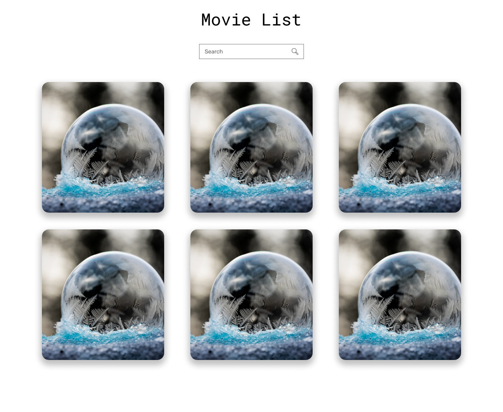
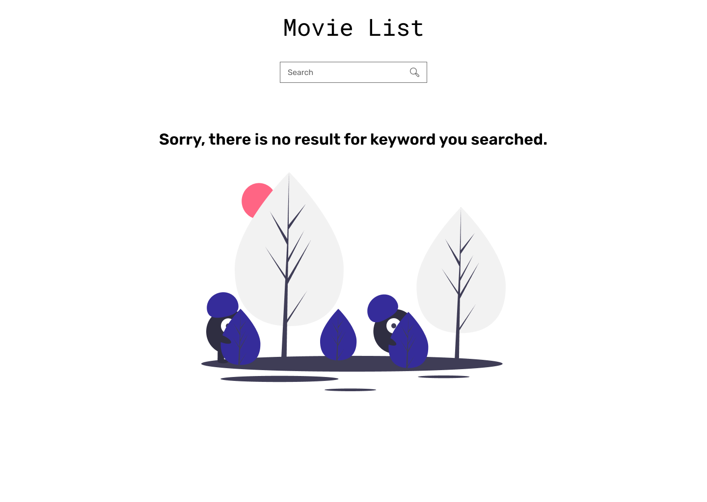

# React Assignment

## Application Features

### **Feature 1:**

User should be able to see a list of movies with a call to action **Book now** on hovering over the movie thumbnail. 

**Please check the following references:**

**Homescreen**
 

**Movie Thumbnail default state**
 

**Movie Thumbnail hover state**
 

### **Feature 2:**

When user searches for a movie, relevant movie must be displayed, the ui layout will look to similar to homescreen.

### Feature 3:

When the user searches for a search term that is not available in the database, the user should see the no data available screen

**No result screen**
 

## **Feature 3:**

When the user clicks on book now button, they need to redirected to the url `/book/{id}/{movie-name}`
