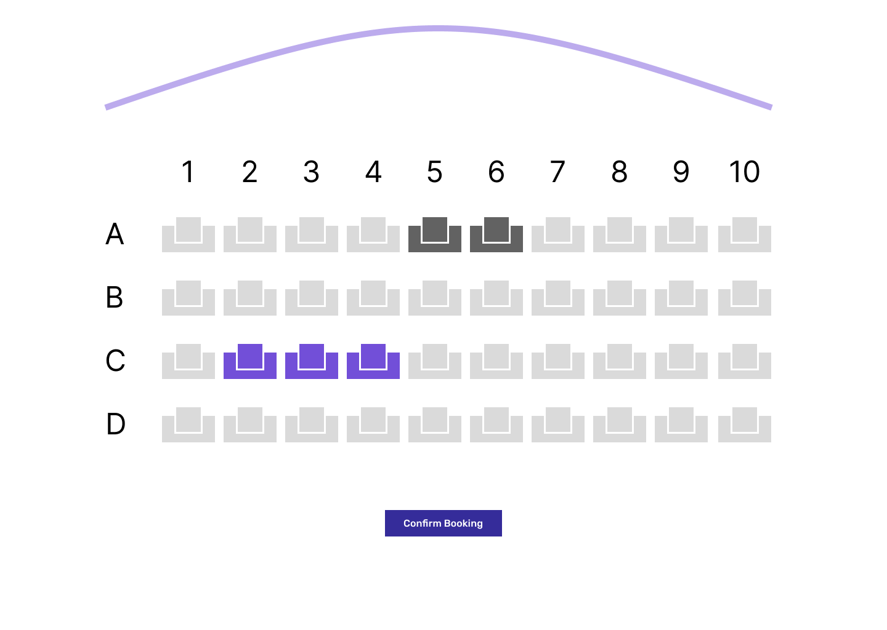
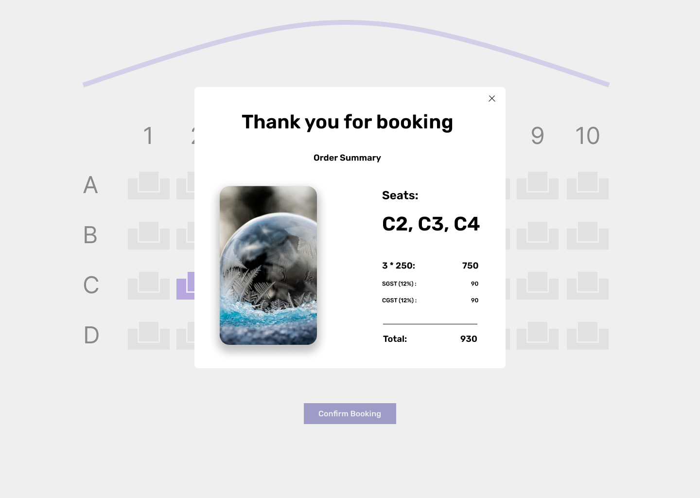

# React Assignment

## How to use the repo

1. Fork this repo from your github profile
2. Clone to your device from the forked repo
3. Run `yarn install` and `yarn start`

## Application Features

### **Feature 1:**

User should be able to see a list of movies with a call to action **Book now** on hovering over the movie thumbnail. 

**Please check the following references:**

**Homescreen**
 

**Movie Thumbnail default state**
 

**Movie Thumbnail hover state**
 

### **Feature 2:**

When user searches for a movie, relevant movie must be displayed, the ui layout will look to similar to homescreen.

### Feature 3:

When the user searches for a search term that is not available in the database, the user should see the no data available screen

**No result screen**
 

## **Feature 3:**

When the user clicks on book now button, they need to redirected to the url `/book/{id}/{movie-name}`. The screen will have options to select seats, show already booked seats and a call to action to confirm booking.
 

## **Feature 4:**

User should be able click on the confirm booking button, they should see a modal with details of the movie thumbnail, seats they selected and prices. When the user closes the modal they should be taken back to the booking screen.
 

## **Technical Pointers**

1. Use styled components for styling
2. Use local storage to persist the data between refreshes
3. Use custom hooks if needed for example when fetching data for trending movies and movies search
4. Try to keep the components more resusable
5. Follow clean code practices in naming variables, functions and components
6. Use SVG for some assets
7. Keep your commits small and follow the conventional commits
8. Make sure you commits are signed

## **Resources**

1. [Styled components](https://styled-components.com/)
2. [Local storage api](https://developer.mozilla.org/en-US/docs/Web/API/Window/localStorage)
3. [Clean code](https://github.com/ryanmcdermott/clean-code-javascript)
4. [Conventional Commits](https://www.conventionalcommits.org/en/v1.0.0/)
5. [Convention commits extension](https://marketplace.visualstudio.com/items?itemName=vivaxy.vscode-conventional-commits)
6. [Setup Signed Commits](https://docs.github.com/en/authentication/managing-commit-signature-verification/about-commit-signature-verification)